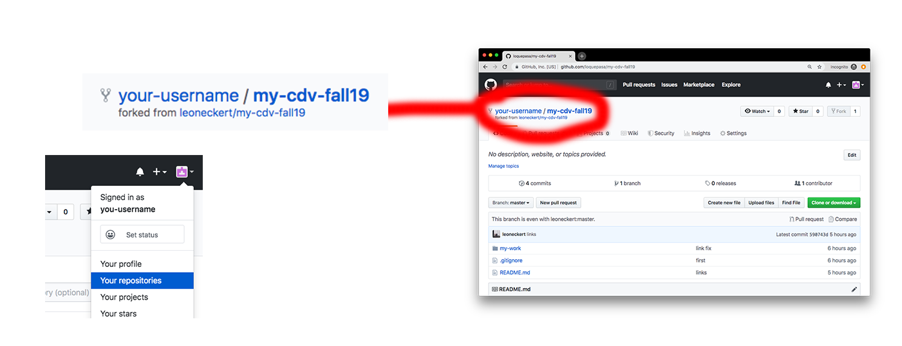
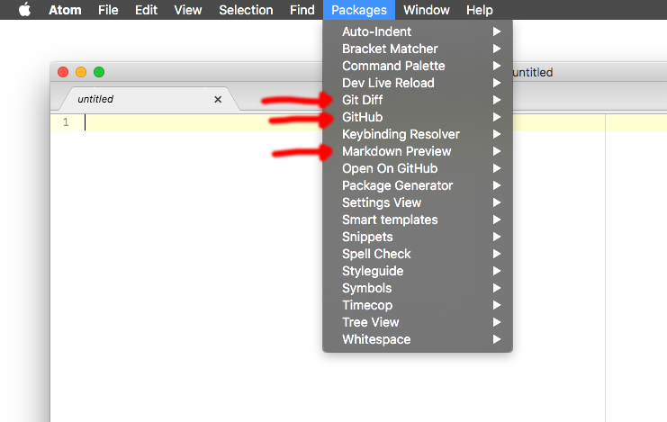
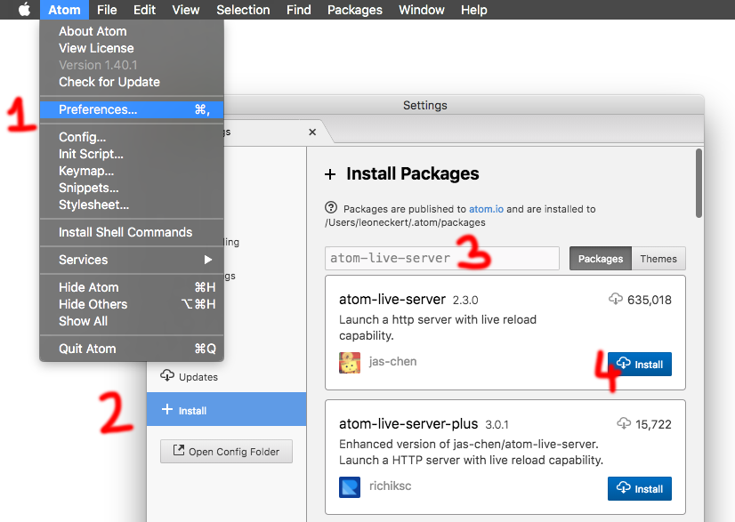

## Coding Foundation: Setup and Exercises

This semester you will be maintaining a Github repository of you own to backup and share your work. Think of a repository as an online backup copy of your local (on your computer) project folder. The idea is this:


As you can see above, there will be two repositories:
- One is the one I am maintaining (red). That is also the one on which you are reading this text right now. Here you will get information and resources throughout the Semester.
- The other repository is your own one (green). It will live on your own GitHub account and you are the only one that is uploading to it. Instead of "uploading", we will call this action **push**. You make changes to your files (and create new ones etc.) on your computer, then you push them to your "remote repository" on GitHub.

The following steps will guide you through setting all this up. Please follow carefully:

###### 1) Make a GitHub account
This is much like setting up any other account, you will not need much help, except, let me recommend to make a student account instead of a regular one. It comes with some nice, free benefits: [https://education.github.com/pack](https://education.github.com/pack)

###### 2) Create your own repository
You can create as many repositories as you like. By the way, repositories are public, everyone can see them. It's great to share code, we should all get used to this. However, keep this in mind so you don't accidentally share sensitive information. But don't worry, I will remind you often and show you ways to avoid it :)
You will find a big PLUS symbol on the top right when you are logged into GitHub. This is where you create new repositories. However (!) in our case we will do it differently. That is because I have prepared some files for you to get started. You will "fork" (make a copy) of a repository I have prepared. Follow [this link](https://github.com/leoneckert/my-cdv-fall19) and click on "fork" in the top right corner:


After some seconds you will be redirected to a page that looks almost the same, but, if you look closely, you will notice that you now have your own copy of the repository that I prepared for you. You can also find it under your repositories on your profile:



#### Software

The order of these steps is not fully worked out :) Now that we have a repository, let's make sure we have the software we will be working with.

###### Google Chrome

This is the browser we will be using. Please [download it](https://www.google.com/chrome/) if you don't have it already.

###### Atom Text Editor

We will be using Atom to write our code. Please download it [here](https://atom.io).

###### Atom Packages

We are going to use four Atom extensions. Three of the come preinstalled. Verify if you see them when you open Atom:



Apart from these there is one more we need. It's called **atom-live-server**. To install it go to ```Atom>Preferences...```, click on ``+ Install``, find **atom-live-server** and hit ``install``:



Verify that it is installed:


<!-- Hi,
welcome to the Critical Data & Visualization class. Please follow the following steps. First, we will set up your work environment for this semester, and then run you through a little JavaScript exercise. In the end, I will show you how to submit things (assignments, poems, memes, etc.) to be shared with me & the rest of the students.

## Chrome Browser

## Text Editor

## GitHub Student Account

## Fork the class repo

## Atom Packages

## Clone the repo through Atom

## Coding exercise


## Submitting things (in this case, your coding exercise)


 -->


<!--##Create a space-->

<!--To start off, please create a directory structure fo everything we will do this semester. Choose a place on your computer that you don't expect to change later on. -->

<!--Create the directories like this:-->

<!--```-->
<!--cdv-->
<!--├── coding-foundation-->
<!--│   └── page1-->
<!--├── lab1-->
<!--│   ├── page1-->
<!--│   └── page2-->
<!--└── lab2-->
<!--```-->

<!--##Text editor-->

<!--In this class we will be using the [Atom Text Editor](https://atom.io) to write code. Unless you feel strongly about a different one, I recommend using the same. Please download it if you don't have it already. -->

<!--##Build an html page-->

<!--In `cdv/coding-foundation/page1`, build a simple html page. Make sure to add some element and some styling. If you want, write some JavaScript (more will follow later).-->

<!--I recommend structuring the page like thisi:-->


<!--```-->
<!--cdv-->
<!--├── coding-foundation-->
<!--│   └── page1-->
<!--│       ├── css-->
<!--│       │   └── styles.css-->
<!--│       ├── index.html-->
<!--│       └── js-->
<!--│           └── myscript.js-->
<!--└── ...-->
<!--```-->

<!--##Serving your website-->

<!--As you were working on the page, how did you see it? If you opened it with you browser, chances are it says something like `file://...` or `/Users/your-name/...` in the URL bar, does it?-->
<!--It this class, we will always be serving the pages we are working on via a "localhost server". If you have never heard of this before, read up on it for 20 minutes (but no longer). The easiest way to use a localhost for our pruposes is an package we can download for atom. It's called *atom-live-server*; please find out how to install and use it, this will be a must-know.-->


<!--##Chrome Developer Tools-->

<!--Unless you feel strongly for a different browser, please use Google Chrome for class. We will be using the Chrome Developer tools all the time. Make yourself familiar by reading the [Introduction](https://www.bitdegree.org/learn/chrome-developer-tools) and chapters about [Elements](https://www.bitdegree.org/learn/inspect-element) and the [JavaScript Console](https://www.bitdegree.org/learn/javascript-console) on this [page](https://www.bitdegree.org/learn/chrome-developer-tools).-->
